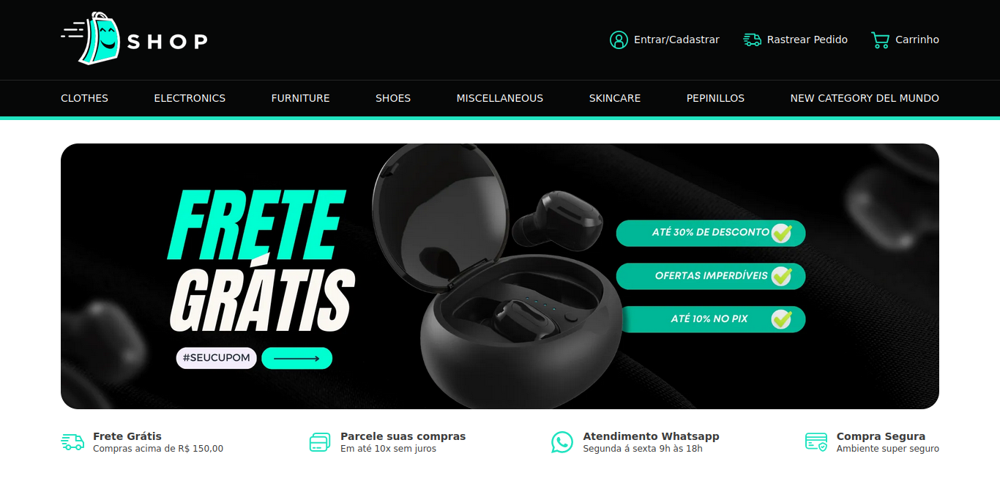

 


# Orgs

 Um projeto de uma aplicação de e-commerce utilizando Vue.js 3, com foco na Option API. O projeto envolve a criação de uma interface de usuário para exibir produtos consumidos de uma API externa e gerenciar um carrinho de compras através de uma API Fake desenvolvido durante o curso de Front End Frameworks.

## 🔨 Funcionalidades do projeto

O App utiliza a API Platzi Fake API para obter dados dos produtos, é possível visualiza cada produto as categoria. Como tambem adicionar items ao carrinho que é feito através de uma API Fake com json-server.


## ✔️ Técnicas e tecnologias utilizadas

As técnicas e tecnologias utilizadas pra isso são:

- `Vue.js 3 (Option API)`: Utilizando Vue.js 3 com Option API para estruturar o frontend da aplicação.
- `Consumo de API Externa`: listagem das produtos utilizando API Platzi Fake API para obter dados dos produtos.
- `API Fake`: Criando uma API Fake com json-server para gerenciar o carrinho.
- `Proops`:  Permite passar dados para um componente é usar propriedades (props).
- `Vue Router`: Criando aplicativos de página única (SPA - Single Page Applications) e criando rotas na aplicação.
- `Personalização de tema`: modificação de cores para o tema do App
- `HTML`: inguagem de marcação utilizada na construção de páginas na Web
- `CSS`: (Cascading Style Sheets ou Folhas de Estilo em Cascata) é uma linguagem de estilo
- `JavaScript`:linguagem de programação interpretada estruturada

## 🎯 Desafio

Tela de detalhes do produto




## 📁 Acesso ao projeto

Você pode [acessar o código fonte do projeto inicial](https://github.com/Joseulisses065/VueShopProject) 

## 🛠️ Abrir e rodar o projeto

```
npm install
```

### Compiles and hot-reloads for development
```
npm run serve
```

### Compiles and minifies for production
```
npm run build
```

### Lints and fixes files
```
npm run lint
```

### Customize configuration
See [Configuration Reference](https://cli.vuejs.org/config/).
